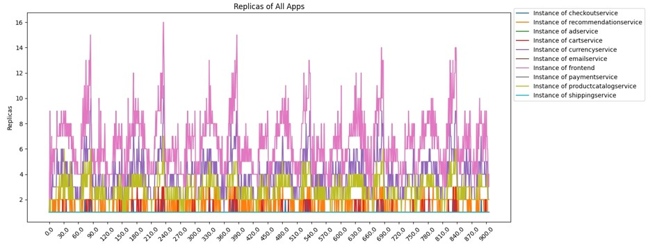

#  scaler

算网融合的k8s集群扩缩容机制

## hpa算法

​        默认HPA 算法必须等到 Pod 的负载达到指定的扩容阈值时，才会触发扩容机制，并且集群生成新的 Pod 需要一定时间，而如果此时遇到突发的大流量请求就很有可能会导致集群扩容不及时而造成响应时间过长。而在集群访问流量骤降时 HPA 算法又会迅速的进行缩容，当遇到第二次突发大流量时，刚缩容完的 Pod 又要马上进行扩容，如此频繁 的伸缩也会导致集群性能受损。

​       拟设计一种既能根据历史数据预测未来负载情况，又能在预测间隔期应对突发流量的算法。

### 算法思路

​       

### 算法内容

#### 1.hpa指标采集

拟采集deployment的qps、入口带宽、出口带宽、磁盘读、写速率作为指标

```go
var (
	qpsQuery         = `sum(rate(istio_requests_total{destination_workload_namespace="%s", destination_workload="%s"}[1m]) offset %ds)`
	receivedQuery    = `sum(rate(container_network_receive_bytes_total{namespace="%s", pod=~"%s-.*"}[1m]) offset %ds)/1024`
	TransmittedQuery = `sum(rate(container_network_transmit_bytes_total{namespace="%s", pod=~"%s-.*"}[1m])offset %ds)/1024`
	readQuery        = `sum(rate(container_fs_reads_bytes_total{namespace="%s", pod=~"%s-.*", container!="POD"}[1m]) offset %ds)`
	writeQuery       = `sum(rate(container_fs_writes_bytes_total{namespace='%s', pod=~'%s-.*', container!='POD'}[1m]) offset %ds)`
)
```

获取历史数据，设预测1m后的数据，则在此时采集过去1m的历史数据序列,平均1获取一次

```go
// 获取普罗米修斯的历史数据
func getHistoryMetrics(query, appName, namespace string, duration int, step int) []float64 {
	if duration%step != 0 {
		panic("参数非法")
	}
	result := make([]float64, 0, duration/step)
	for i := step; i < duration; i += step {
		queryParams := url.Values{}
		queryParams.Add("query", fmt.Sprintf(query, namespace, appName, i))
		baseURL := config.PrometheusUrl + "/api/v1/query"
		url := baseURL + "?" + queryParams.Encode()
	    ......
		result = append(result, data)
		}
	}
	return result
}
```


#### 2.基于二次移动平均法(DMA)预测


代码中，n为窗口大小，T为预测未来T个周期(60s)内的数据大小。

```go
// 一次移动的平均值
func MovingAverage(data []float64) float64 {
	sum := float64(0)
	for _, v := range data {
		sum += v
	}
	return sum / float64(len(data))
}

// 一次移动后的时间序列
func FirstMovingSequence(data []float64) []float64 {
	n := len(data)
	if n == 0 {
		return []float64{}
	}

	result := make([]float64, n)
	sum := float64(0)

	// 从数组末尾开始计算
	for i := n - 1; i >= 0; i-- {
		sum += data[i]
		result[i] = sum / float64(n-i)
	}

	return result
}

// 预测负载
func PreditLoad(datas []float64, T int) float64 {
	m1 := MovingAverage(datas)
	firstDatas := FirstMovingSequence(datas)
	m2 := MovingAverage(firstDatas)
	a := 2*m1 - m2
	b := 2 * (m1 - m2) / float64(len(datas)-1)
	return a + b*float64(T)
}
```

预测结果

```go
func main() {
	timer := time.After(59 * time.Second)
	fmt.Println(time.Now())
	s := hpa.GetHistoryMetrics(hpa.QpsQuery, "frontend", "boutique", 60, 1)
	fmt.Printf("原始时间序列为：%v\n", s)
	
    //得到预期负载
	a := hpa.PreditLoad(s, 60)
	fmt.Printf("预测1m后的负载为:%v\n", a)

    //一分钟后获取真是负载
	<-timer
	f := hpa.GetQuery("frontend", "boutique", hpa.CurrentQps)
	fmt.Printf("一分钟后的实际负载是:%v", f)

}
```


#### 3.动态阈值调整

​     基于动态阈值的容器云弹性伸缩主要是通过动态下降算法来调整扩缩容的阈值。

​                                           

```go
// calculateDynamicThreshold 计算动态阈值
func calculateDynamicThreshold(fx, historicalAvg, loadGrowthRate float64) (float64, float64) {
	expansionThreshold := fx - historicalAvg*loadGrowthRate
	shrinkThreshold := fx + historicalAvg*loadGrowthRate
	return expansionThreshold, shrinkThreshold
}
```

#### 4 核心策略

​         通过二次移动平均法预测未来资源需求，动态下调扩容阈值 *T*expansion，在预测间隔期（默认 60 秒）内，当负载达到 *T*expansion 时提前创建新 Pod，避免突发流量导致的服务质量下降。

#### 疑点

1.


​                                                      集群默认策略为什么会滞后这么多?滞后时间近似俩小时，若真是这样那意义何在?


2. 

​                                                  metrics-server默认的指标采集频率15s，1s抓取一次数据，太频繁，数据重复，prometheus压力过大

## 后续待解决

1.依据任务类型给微服务分类:计算敏感，存储敏感，网络敏感，不同类型的参数选择选择。



​                                                                                    依据cpu使用率的扩缩容后，可看cpu消耗情况


​                                                                                                              qps情况

2.多重指标加入算法的改进策略，综合得到期望副本数

3.二次平移法仅考虑平均数，未考虑上升下降的趋势，不是太准。复现一下指数平滑法。